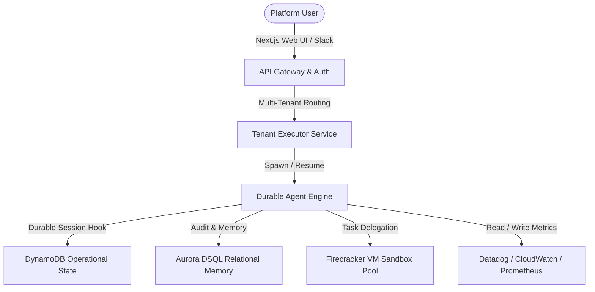

# 🌌 Rhea: Autonomous DevOps & Incident Response Agent

Rhea is an **Autonomous Incident Response & DevOps Agent** designed for multi-tenant, production-grade cloud environments. Built on top of the **Eve Framework** and powered by **Next.js** and **AWS Aurora DSQL**, Rhea acts as a durable, sandboxed engineer that automates the lifecycle of production incidents: from alerting and logs inspection to drafting, verifying, and executing hotfixes under human supervision.

---

## 🏗️ SaaS Architecture & Vision

Rhea combines secure sandbox boundaries with a durable model execution loop to safely run DevOps diagnostics and code mutations.



### 🛡️ Security & Sandbox Boundaries
Rhea runs potentially destructive diagnostics and fixes inside dedicated **Firecracker microVMs** or **gVisor container runtimes**.
*   **Zero-Trust Egress**: The sandboxed VM operates behind a domain-specific network proxy. Outbound traffic is restricted solely to authorized integration endpoints (e.g. `api.datadog.com`, `api.github.com`), completely blocking access to local subnet ranges and AWS link-local metadata endpoints (`169.254.169.254`).
*   **Credential Brokering**: Decrypted configuration credentials (like GitHub PATs or Datadog API keys) are injected into sandbox network request headers via secure proxy transformations rather than exposing raw secrets inside the guest VM environment.

---

## ⚡ Key Features

*   **Durable Incident Lifecycles**: Survives database connection dropouts, worker restarts, and network losses via Eve's durable execution framework.
*   **Relational Memory Engine**: Stores incident logs, investigated root causes, and successful remediation templates in an AWS Aurora DSQL database to dynamically match similar future failures.
*   **Multi-Tenant Cockpit**: A secure Next.js dashboard featuring organization settings, interactive agent chats, real-time log streams, and human-in-the-loop (HITL) approval gates.
*   **Extensive Connectors Hub**: Integrates with Datadog, Prometheus, GitHub, Slack, and AWS resources.

---

## 📂 Project Layout

The repository is structured logically to isolate backend agent logic, frontend UI views, and database interactions:

```
├── agent/                  # Core Eve Agent logic
│   ├── agent.ts            # Entry point; initializes the Gemini Vertex model
│   ├── instructions.md     # Operational lifecycle & execution instructions
│   ├── channels/           # Inbound/outbound communication interfaces
│   ├── connections/        # Connector authentication profiles
│   ├── subagents/          # Specialized task-specific agents
│   │   ├── planner/        # Formulates execution plans
│   │   ├── investigator/   # Executes logs/metrics diagnostics
│   │   ├── sandbox/        # Isolates unsafe command runs
│   │   ├── remediation/    # Proposes and drafts fixes
│   │   └── approver/       # Manages Human-In-The-Loop approval gates
│   └── tools/              # Custom agent tools (dsql connectors, bash, files)
│
├── app/                    # Next.js 15+ App Router UI Cockpit
│   ├── (dashboard)/        # Cockpit dashboard routes (connectors, incidents, chat)
│   ├── _components/        # Dashboard layout, charts, and messaging views
│   ├── api/                # Tenant-scoped API endpoints (alerts, team, sandboxes)
│   └── eve/v1/[...path]/   # Catch-all API proxy for the Eve agent local runtime
│
├── components/             # Reusable UI component primitives
├── lib/                    # Shared backend utilities
│   ├── auth.ts             # Auth.js / NextAuth configuration
│   ├── crypto.ts           # AES-256-GCM encryption/decryption helper
│   ├── dsql.ts             # Aurora DSQL postgres client adapter & IAM Token signer
│   ├── dynamodb.ts         # AWS DynamoDB client connection
│   └── init-db.ts          # Database migration & schema initialization script
│
├── demo-app/               # Sandbox test application containing common faults
└── package.json            # Node dependencies and project build scripts
```

---

## 🗄️ Relational Database Schema (Aurora DSQL)

Rhea uses AWS Aurora DSQL (PostgreSQL-compatible) for distributed multi-tenant memory. The tables are configured as follows:

| Table Name | Description | Key Fields |
| :--- | :--- | :--- |
| `organizations` | Tenant accounts partitioning data boundaries. | `org_id`, `name`, `created_at` |
| `users` | Admin & DevOps operators belonging to organizations. | `user_id`, `org_id`, `email`, `role`, `provider` |
| `api_keys` | API keys used for external webhooks/integrations. | `key_id`, `org_id`, `key_hash`, `scopes` |
| `incidents` | Tracks diagnostic status and current active sessions. | `incident_id`, `org_id`, `title`, `status`, `agent_session_state` |
| `investigations` | Incident findings, categories, and ranked potential causes. | `investigation_id`, `incident_id`, `ranked_causes`, `findings` |
| `root_causes` | Deconstructed details of discovered anomalies. | `cause_id`, `investigation_id`, `category`, `description`, `confidence` |
| `fix_patterns` | Relational memory templates linking issues to fixes. | `pattern_id`, `cause_category`, `remediation_template`, `success_rate` |
| `connector_instances` | Configuration and encryption keys for Datadog, Slack, etc. | `instance_id`, `org_id`, `connector_type`, `config_encrypted` |
| `sandbox_sessions` | Tracks active sandboxed VM limits and domain filters. | `session_id`, `org_id`, `allowed_domains`, `status` |
| `sandbox_executions` | Detailed stdout, stderr, and performance metrics audit trail. | `execution_id`, `session_id`, `command`, `exit_code`, `stdout`, `stderr` |

---

## 🚀 Getting Started

### 1. Prerequisites
*   Node.js 24+
*   AWS Credentials with access to Aurora DSQL and DynamoDB.
*   Gemini API Key or Google Vertex Credentials.

### 2. Environment Variables
Create a `.env.local` file at the root of the project with the following configuration:
```env
# Database Configuration
DATABASE_URL=postgresql://admin@<endpoint>:5432/postgres

# AWS Credentials (DSQL signer and DynamoDB)
AWS_ACCESS_KEY_ID=your-access-key-id
AWS_SECRET_ACCESS_KEY=your-secret-access-key
AWS_REGION=ap-south-1

# Gemini/Google Vertex LLM API Key
GEMINI_API_KEY=your-gemini-api-key

# Auth configuration & security keys
AUTH_SECRET=generate-a-secure-random-string
ENCRYPTION_KEY=32-character-encryption-key-for-AES

# OAuth Provider details
AUTH_GITHUB_ID=your-github-oauth-client-id
AUTH_GITHUB_SECRET=your-github-oauth-client-secret
AUTH_GOOGLE_ID=your-google-oauth-client-id
AUTH_GOOGLE_SECRET=your-google-oauth-client-secret
```

### 3. Setup Dependencies & Initialize DSQL
```bash
# Install NPM packages
npm install

# Build database schemas & tables in Aurora DSQL
npx tsx lib/init-db.ts
```

### 4. Running the Development Environments
Start the Next.js local cockpit interface:
```bash
npm run dev
```

Start the Eve interactive agent server (runs the model loops, streams state, and serves local endpoints):
```bash
npx eve dev
```

---

## 🤝 Contributing & Code Review

Please review our [Contributing Guidelines](file:///c:/projects/rhea/CONTRIBUTING.md) and [Code Owners](file:///c:/projects/rhea/.github/CODEOWNERS) configuration prior to submitting Pull Requests.
All mutations and network egress changes require strict security verification before merging into the main branches.
