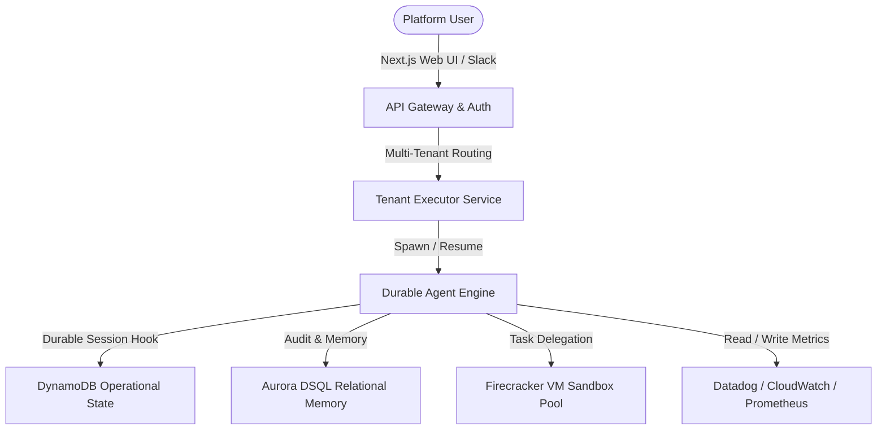

# Rhea SaaS Roadmap: Future Connectors & Features

Rhea is an Autonomous Incident Response & DevOps Agent. This plan outlines the architecture, advanced connectors, sandbox scaling, and enterprise capabilities required to expand and scale Rhea as a commercial, production-grade SaaS platform.

---

## 1. High-Level SaaS Architecture

### Key Pillars
- **Secure Sandbox Isolation**: Run untrusted diagnostics and fixes inside dedicated Firecracker microVMs per tenant.
- **Durable Incident Lifecycle**: Ensure agent sessions survive database connection loss, network drops, or worker restarts via Eve's durability framework.
- **Relational Memory Sync**: Aggregate historical patterns in distributed SQL databases (Aurora DSQL) to dynamically retrieve past success templates.

---

## 2. Advanced Observability & Cloud Connectors

To function in real-world environments, Rhea requires bi-directional integrations across the entire cloud and monitoring stack:

### A. Observability Integrations
- **Datadog Integration**:
  - Retrieve real-time APM metrics, span errors, and infrastructure alerts.
  - Parse log indexes directly using Datadog log queries to pinpoint regression timings.
- **Prometheus & Grafana**:
  - Connect to PromQL endpoints to evaluate query rates, error percentages, and latency metrics.
  - Automatically read Grafana dashboard specs to replicate human diagnostic workflows.
- **Sentry & Rollbar**:
  - Consume Sentry issue webhooks to trigger Rhea investigations immediately on error spikes, including stack trace parsing and source mapping.

### B. Cloud Providers (Multi-Cloud Diagnostics)
- **AWS (EKS, ECS, Lambda, RDS)**:
  - Deep inspect Kubernetes pods, check container logs, and query target groups.
  - Analyze RDS CPU spikes, locking queries, and auto-scale status.
- **Google Cloud Platform (GKE, Cloud Run, Cloud Spanner)**:
  - Pull metrics from GCP Cloud Logging and Stackdriver.
  - Query GKE namespace states and check IAM service account scopes.
- **Microsoft Azure (AKS, App Service, Cosmos DB)**:
  - Query Azure Monitor log analytics and trace AKS service failures.

---

## 3. Sandboxed Execution & Scaling

The sandbox is the critical trust boundary. In production, sandboxing must scale securely:

### A. Production microVM Pool
- **AWS Firecracker VM Provisioning**:
  - Spawn lightweight, jail-isolated microVMs in <100ms.
  - Map tenant-specific workspaces to encrypted block devices that are destroyed instantly upon session termination.
- **gVisor Container Isolation**:
  - For lighter tasks, run container runtimes inside sandboxed kernels (gVisor) to filter system calls safely.

### B. Network Egress Policies
- **Domain-Specific Proxying**:
  - Enforce zero-trust egress by default.
  - Dynamically open network tunnels *only* to verified provider endpoints (e.g. `github.com`, `datadog.com`) using credential broker proxies, preventing data exfiltration from the tenant sandbox.

---

## 4. Collaborative Enterprise Features

A SaaS platform must fit seamlessly into existing engineering organization workflows:

### A. GitHub App Integration
- **Auto-Drafting Pull Requests**:
  - Authorize Rhea as a GitHub App with restricted repository permissions.
  - Auto-draft fixes, assign reviewers, run pre-commit checks in the sandbox, and link PRs back to incident records.
- **Interactive PR Code Reviews**:
  - Allow engineers to comment on Rhea's PRs; the agent interprets review feedback and modifies the patch accordingly inside the sandbox.

### B. Interactive Slack & MS Teams Bots
- **Continuous Slack Feeds**:
  - Deliver interactive alert logs directly to channels.
  - Embed Slack **Approve / Deny** buttons for one-click deployment verification.
- **HITL Verification Gates**:
  - If Rhea proposes a mutation (e.g. running a Terraform script), the bot posts the plan to Slack, waiting for an approved principal ID before resuming.

### C. Tenant Organization & RBAC Model
- **Multi-Tenant Model**:
  - Partition session stores, incident graphs, and operational logs by Organization IDs.
  - Implement Role-Based Access Control (RBAC) to restrict mutating actions to Senior DevOps engineers.

---

## 5. Machine Learning & Memory Engine

### A. DSQL Vector-Based Memory
- Store historical root causes and fix templates inside Aurora DSQL.
- Match active incidents against past occurrences using vector embedding queries to instantly recommend remediation strategies with high success-rate metrics.

### B. Continuous Pattern Learning
- Log user approvals and rejections of Rhea's fixes.
- Train local reward models or modify agent prompts dynamically to fine-tune incident diagnostic steps based on human feedback.
